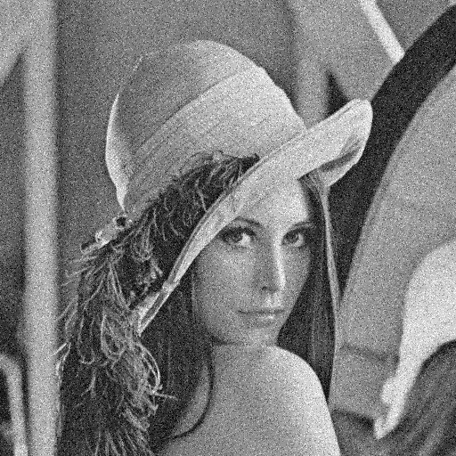
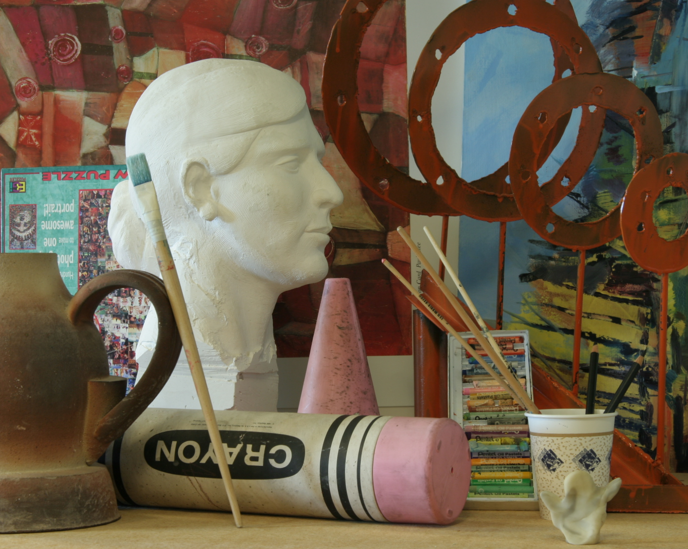

# Bilateral filtering
---
## example usage

```
upsampling.exe image_path output_folder
```

or

```
upsampling.exe depth_image_to_upscale rgb_guide_img output_folder
```

## Task 1: grid search of bilateral filters

### results on a noisy grayscale lena image.

 

| | 2 | 4 | 8 | 12 |
|---|---|---|---|---|
| 2 |  | |  |  | 
| 4 |  |  |  |  |
| 8 |  |  |  |  |
| 16|  |  |  |  |

Horizontally: spatial sigma / Vertically: spectral sigma


## Task 2: Upscale a depth image using iterative joint bilateral filtering

### RGB Image as a guide (1390x1110), and a really downscaled depth image

  

### Result with both sigmas = 4


I think that is a surprisingly nice result, even without using median bilateral filter.

### TODO:
 - 1D gaussian kernel
 - Color distance measurement in Las
